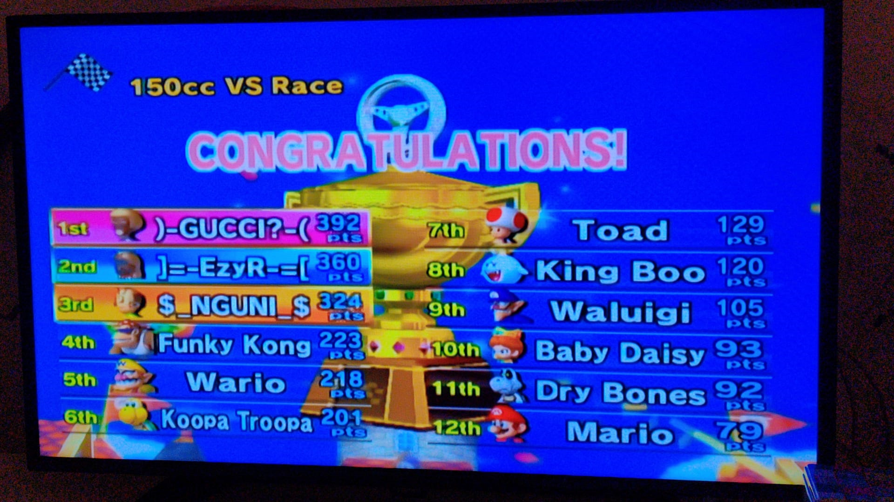

# Da Rules

``` 

* We spelen op de wii.  
* Alleen cups waar alle 3 de leden van deelnemen zijn legitiem.
* De cups kunnen enkel bestaan uit 16 of 32, de rest wordt niet opgenomen.
* Voor het huidige seizoen kan niet van controller worden gewisseld.
* De races worden hier bijgehouden voor volledige transparantie.

```

# De spelers

De boiis van Raasdorperweg, born and raised in Lijnden. Mario Kart legendes. 

<table>
  
    
      <tr>
        
          <th>{{ pair[0]}}</th>
        
      </tr>
    
    <tr>
      
        <td>{{ pair[1]}}</td>
      
    </tr>
  
</table>

# Race History
<table>
      <tr>
        <th> Result </th>
        <th> Date </th>
        <th> Races </th>
        <th colspan="2"> 1st place </th>
        <th colspan="2"> 2nd place </th>
        <th colspan="2"> 3rd place </th>
      </tr>
      
  
      <tr>
        <td>  </td> 
        
            <td>{{ pair[1]}}</td>
        
        </tr>
  
</table>